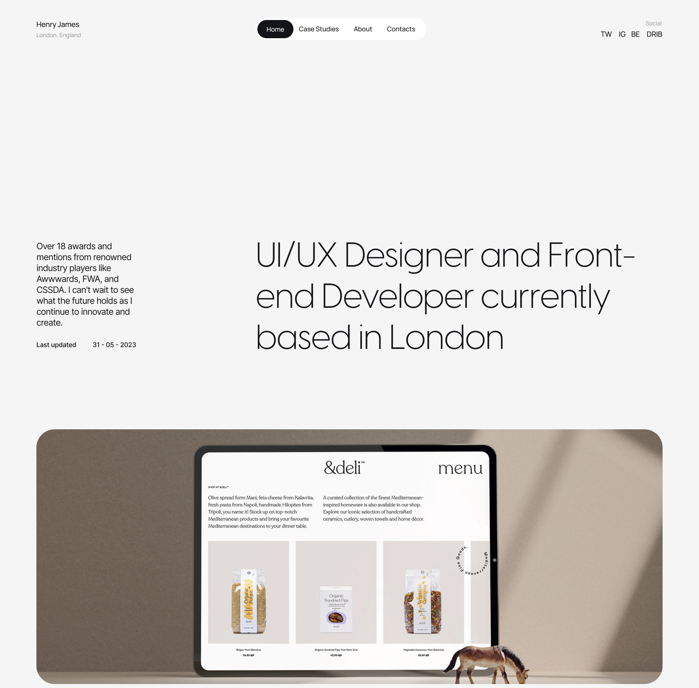

# Correlation One - Portfolio Project

# Project 2
## Rubric
### Goals

In this exercise, you will:

1. Define the message for your personal website
2. Choose the HTML elements
3. Create an HTML landing page

### Introduction

In this exercise, you will create a landing page for your HTML website. Landing pages are single-page websites that serve as the home page of your website. They are typically used to collect email addresses or other contact information from visitors who want more information about your product or service.

The goal of this exercise is to build an HTML landing page that includes:

- A header and footer with standard elements such as navigation, branding, and search functionality
- Content area with text and images that explain what you do and how you do it
- A call-to-action button that encourages visitors to sign up for something (like a request for information where they submit a question and their contact information.

###  Instructions

- Create an HTML landing page
- Utilize the advanced HTML elements

You’ll need to do the following:

1. Design a header for your landing page. This should include an image and text that clearly tell visitors what they can find on the site.
2. Create an introduction to your site, which should provide details about the purpose and mission of your site. Include some information about yourself and why you’ve created it in this section as well.
3. Design an About Me section that includes more detailed information about yourself and why you created this website. This should include links to other websites where people can find out more about you if they’d like additional information (such as LinkedIn).
4. Write out at least two paragraphs of text explaining what each section of your site contains (for example, if there’s a blog or news feed on the site). You don’t need to write out every single piece of content—just enough so that someone visiting the site gets an idea of what it looks like without having to click around too much first!
5. Write a blog post about your journey to become a web developer! Summarize what you’ve learned so far, and what you’ve found most interesting.
6. A call-to-action button that encourages visitors to sign up for something (like an email newsletter) or make a purchase

Post your code in the text editor below

An example of a landing page with the tools that we’ve learned until these moment:
## Solution

### Design Inspiration
_*(It's not inspiration actually, I'm just gonna implement it as is 🙈🤣)_

I'm not a designer, so I purchased some figma design files for a really nice portfolio. Figured this was a good chance to practice converting design files into actual code.
### Usage
You can view the site at this particular stage at this [url](https://deploy-preview-3--gbockari.netlify.app/)
