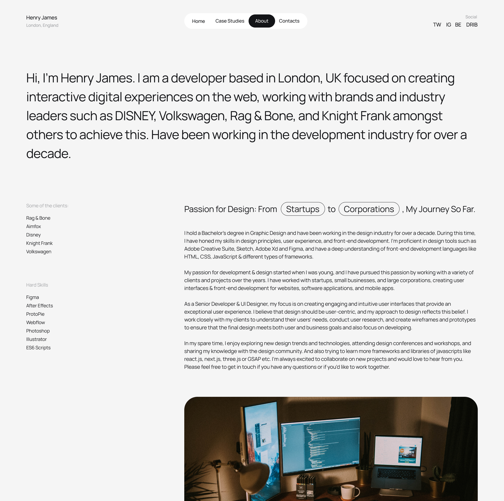

# Correlation One - Portfolio Project

# Project 1
## Instructions
Write the html code for a web page about yourself. This page typically contains the following elements:

1. A short biography. Include sections on:

- interesting experiences
- hobbies
- work goals
- things you enjoy

2. Highlight your work and personal achievements

Be sure to include the following HTML elements learned this week:

1. Headings
2. Images
3. Paragraphs
4. Lists
5. Links

## Solution

### Design Inspiration
_*(It's not inspiration actually, I'm just gonna implement it as is 🙈🤣)_

I'm not a designer, so I purchased some figma design files for a really nice portfolio. Figured this was a good chance to practice converting design files into actual code.
### Usage
navigate to the about page.
